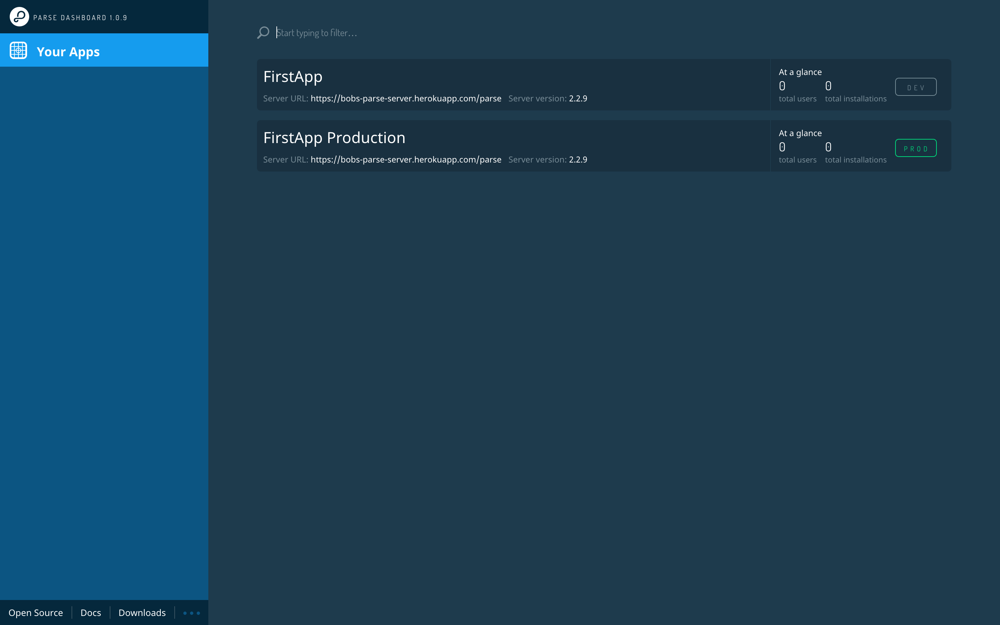

In order to build a photo sharing app, we will need to exchange information between multiple users on multiple devices.

In the *Make School Notes* tutorial we built an app that only stores information locally on the user's phone. There is no way of sharing information with other users or accessing notes from other devices. This is fine for some apps; however, most applications need to provide a way for multiple users to interact with each other. In such cases we need to store the information used in the app on a server that is accessible by all users.

#What Does Parse Do for Us?

Until a few years ago, it was necessary to write an entire server application to handle the server side code of your app - now we can use the Parse platform instead. Parse allows us to define the different types of objects we want to store in our application, as well as the relationships between them.

Additionally Parse provides an iOS library. This makes it easy to interact with the Parse server from within our app.

We have prepared a brief lecture that will introduce you to the core concepts of the Parse framework:

<iframe width="560" height="315" src="https://www.youtube.com/embed/q8NW_FrwQ5A" frameborder="0" allowfullscreen></iframe>

You can download the slides [here](https://s3.amazonaws.com/mgwu-misc/SA2015/LectureSlides/ParseIntro.pdf).

Throughout this tutorial you will get to know Parse in detail. Our very first step is setting up a Parse account and setting up our first app.

#Setting up a Parse Server

Parse used to be a hosted service - you could set up a backend and get free hosting through [Parse.com](http://parse.com/). Parse has discontinued this service, but they open-sourced their platform at the same time. The cool thing about Parse now being open source is that a community has formed, and the code is being maintained and improved. The bad news is that you have to set up your own hosting, and it's a little bit more complicated than it was before. However, many people actually find this to be a positive thing, because by hosting it yourself, you have more control over your server. We have made a completely separate tutorial that will guide you through setting up your own Parse server and Parse dashboard.

If you're viewing this tutorial on [Make School's Online Academy](https://www.makeschool.com/academy/) you can find the Parse tutorial [here](https://www.makeschool.com/academy/tutorial/set-up-your-own-parse-server/setting-up-parse-on-heroku). Otherwise, you can find it [here](https://github.com/MakeSchool-Tutorials/Parse-Server-Setup/blob/master/P00-Setup-Parse-Server/content.md).

Once you have gone through that tutorial you will have a Parse server set up, and you should be able to log into your dashboard. It should look like this:

You should note that due to how [Heroku's pricing](https://www.heroku.com/pricing) works, your free Parse server and dashboard will sleep when they are not being used. As a consequence, the first action you take after a period of inactivity will sometimes take upwards of 2 seconds. Subsequent actions will seem much snappier in comparison. Heroku's paid tiers remove this limitation.

> [action]
Log in to your dashboard and select the first instance of your app that says `AppName` but not `AppName Production`

This is the place where we can see and edit the data model for our application. Before we dive into the details of how to create new classes, we should discuss what the data model for *Makestagram* should look like.
