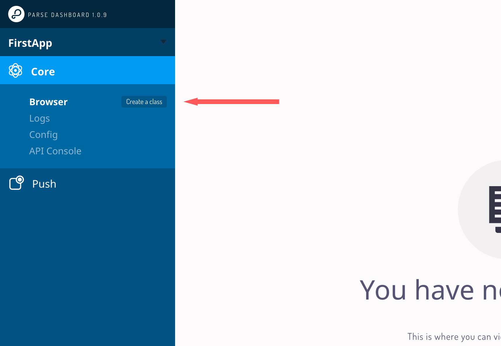
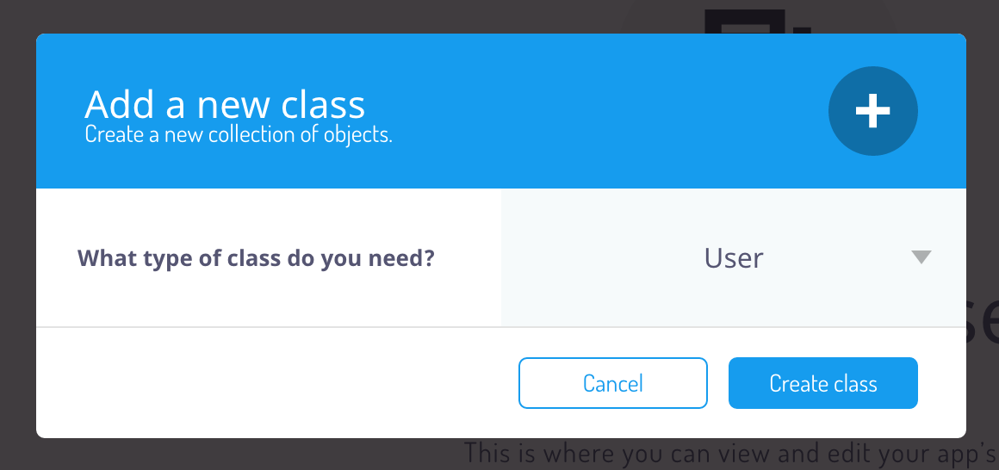
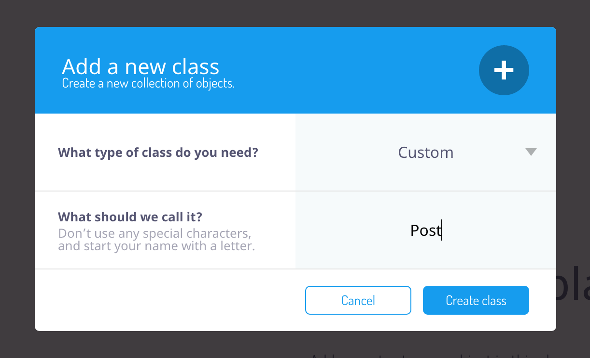
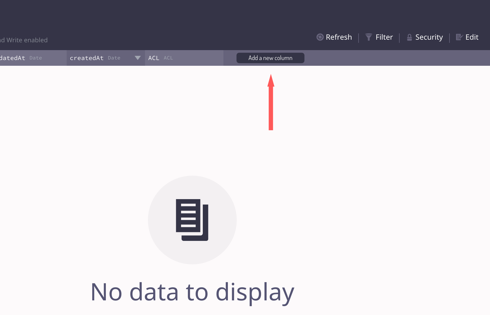
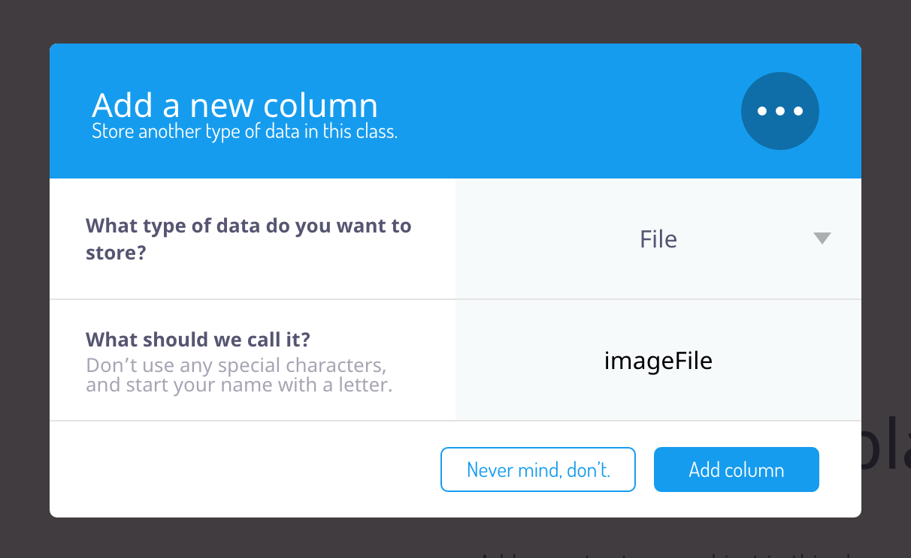
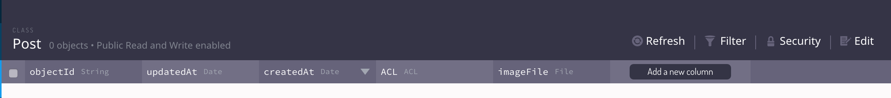
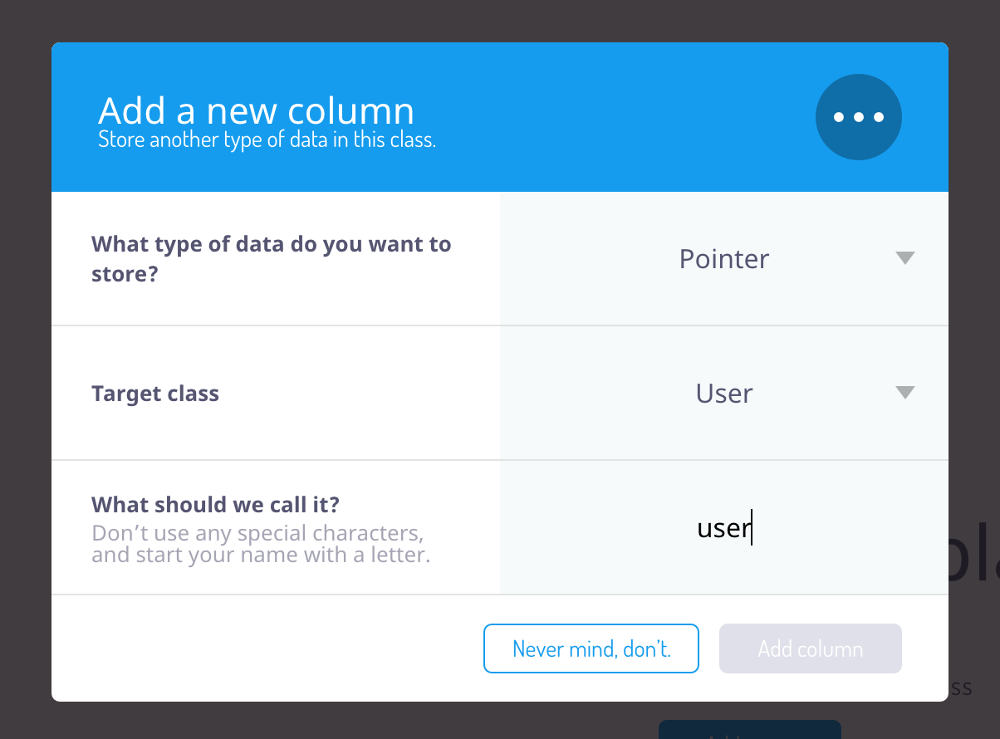

Time to pull up your browser again. If you're on the Parse Dashboard, click on your `APP_NAME` button, the one that says "DEV" on the right side. Make sure that you are on the *Core* page of the Parse browser, where you can see your current empty data model:

#Creating the User Class

Let's first create the *User* class. Parse provides a template for this class which makes the setting it up pretty easy.

> [action]
First, select the *Create a class* button on the left hand side to create your first class:
>

Next, you will see a popup that allows you to choose the type of your class.

> [action]
Select the *User* class from the dropdown and click *create Class*:
>

Now we have a *User* model set up. That will allow us to sign up and log in users!

#Creating the Post Class

Next, let's create our first entirely custom class: the *Post* class.

> [action]
Select the *Create a class* button on the left hand side to create the *Post* class:
>

Next, you will again see the popup that allows you to choose the type and name of the class.

> [action]
Choose the name to be *Post* and leave the class type as is (*Custom*). Then hit the *Create class* button:
>

Now you've created a new class that will be used to store our posts. It comes with 4 default columns (columns are basically the same as properties on classes): *objectID*, *createdAt*, *updatedAt*, *ACL*. These default columns exist on every Parse object and their content is maintained by the Parse framework; we don't need to discuss them in detail now.

#Adding Columns to a Class

In addition to the default columns we need to create columns for all of the custom properties of our classes. The *Post* class has two custom properties:

- **imageFile** this property stores the uploaded photo
- **user** this property is a reference to the user that created the post

##Adding the Photo Column

Let's go ahead and add them.

> [action]
You add a column by hitting the *Add a new column* button in the top bar of the data browser:
>

Then you'll see a popup that will ask you to specify details about this new column. We need to choose the *type* and the *name* of the column. To store binary data (such as photos, zip-files, etc.) we use the *File* type.

> [action]
Set the type of the column to *File* and name it *imageFile*. Then hit the *Add column* button:
>

Now you should see the new *imageFile* column in the data browser:

##Adding the User Column

Now it's time to add the *user* column. Unlike the *imageFile* column the *user* column is not intended to store actual data - instead it stores a reference (or relationship) to an existing *user* object.

For such use cases, Parse provides the *Pointer* column type. A pointer column allows us to store a reference to another Parse object.

> [action]
Click the *+Add a new column* button to create a new column, just as in the step before. Choose this column to be a *Pointer* type. Parse will ask you which class this pointer is pointing to. Choose the *User* class. Finally, name the column *user* and click the *Add column* button:
>

By now you should have a basic understanding of how to create new classes and columns in Parse. That's an important thing to know to get up to speed on your own app down the road!

#Adding the Remaining Classes

Let's create the remaining classes so that we can start coding!

We will skip the step-by-step instructions on how to create the classes and columns - if you happen to get stuck, skim back through the previous instructions!

> [action]
> Perform the following steps to create all relevant Parse classes:
>
1. Add a new custom class called *Like*.
	1. Add a *Pointer* column that points to the class *User* and name it *fromUser*
	2. Add a *Pointer* column that points to the class *Post* and name it *toPost*
2. Add a new custom class called *Follow*
	1. Add a *Pointer* column that points to the class *User* and name it *fromUser*
	2. Add a *Pointer* column that points to the class *User* and name it *toUser*
3. Add a new custom class called *FlaggedContent*
	1. Add a *Pointer* column that points to the class *User* and name it *fromUser*
	2. Add a *Pointer* column that points to the class *Post* and name it *toPost*

Well done! The entire data model is set up! Now we can dive into Xcode and get started building our photo sharing app!
