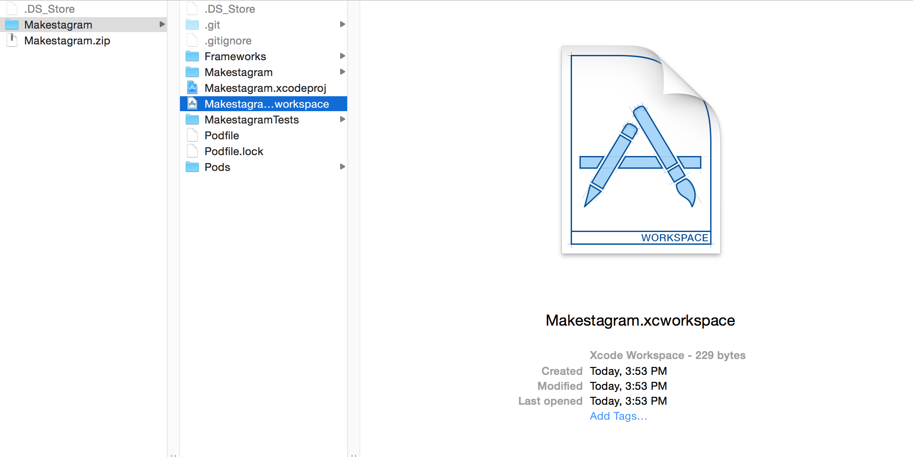

Time for some coding! Setting up the Xcode project for Makestagram would take a decent amount of time. We would need to add the Facebook and ParseSDKs and add a bunch of other system frameworks that these SDKs need.

Instead of going through these steps now, we will start with a template project that has all the required libraries set up. That way we can start coding right away. Once you have completed the entire *Makestagram* tutorial, you will have access to a separate tutorial that will teach you how to set up an Xcode project that uses Facebook and Parse from scratch.

But there is a catch! In order to save all this time, we are using a tool called _CocoaPods_. This will take care of all the third party libraries we rely on. As for the system libraries, we have already included them.

> [action]
Get started by downloading our [Starter Project](https://github.com/MakeSchool-Tutorials/Makestagram-Swift-V2-Starter/archive/master.zip).
Once the download completes, unzip the project. Copy the project to the folder where you typically store your coding projects.


#What Is a Dependency Manager?

One way of adding third-party code to your project would be to download all of the source code and copy it into your project.

This may sound straightforward, but in reality this approach will fail for many projects. Many third-party libraries come with their own dependencies and very special rules about how they need to be compiled; information that is not in the source files but in the project file of the library.

Even if that approach works, you will have a hard time updating the library. You will have to remove all code and add it again.

To avoid these kinds of problems, software developers have built dependency managers. The most popular one for iOS is _CocoaPods_.

#How Does CocoaPods Work?

_CocoaPods_ provides a huge repository of available iOS libraries. When you want to use _CocoaPods_ you add a special file to your project in which you can list your dependencies. That file is called a _Podfile_.

If you want to use a library, you need to enter the name (and optionally the version) of the library into your _Podfile_. Then you can use one of _CocoaPods_ commands to install the library that you listed in the _Podfile_.

#Installing CocoaPods

As a first step, we need to install the _CocoaPods_ software.

> [action]
> Open a terminal and enter the following line:
>
    sudo gem install cocoapods

After a while the installation should complete successfully!

#Setting up A Podfile

Now we can create a _Podfile_ that will allow us to declare dependencies for our project. The _CocoaPods_ tool provides us with a convenient method to do this:

> [action]
> Open the root directory of your project in a terminal and type:
>
    pod init

Now a _Podfile_ with some skeleton content will be created. Open the _Podfile_ in your favorite text editor. It should look like this:

```
# Uncomment this line to define a global platform for your project
# platform :ios, '9.0'

target 'Makestagram' do
  # Comment this line if you're not using Swift and don't want to use dynamic frameworks
  use_frameworks!

  # Pods for Makestagram

  target 'MakestagramTests' do
    inherit! :search_paths
    # Pods for testing
  end

end
```

#Installing Our Dependencies

Now we are ready to add our dependencies to this file.

> [action]
> Update your _Podfile_ so that it looks like this. Note that we uncommented the `platform :ios, '9.0'` line:

>
	# Uncomment this line to define a global platform for your project
	platform :ios, '9.0'
>	
	target 'Makestagram' do
	  # Comment this line if you're not using Swift and don't want to use dynamic frameworks
	  use_frameworks!
>	
	  pod 'Bond', '4.0.0'
	  pod "ConvenienceKit"
	  pod 'Parse'
	  pod 'ParseFacebookUtilsV4'
	  pod 'ParseUI'
>	
	  target 'MakestagramTests' do
	    inherit! :search_paths
	    # Pods for testing
	  end
>	
	end
>
> Then, return to the command line and run:
>
    pod install
>

Now your dependencies will be download and installed.

**The next step is very important.** After you have installed your first library, _CocoaPods_ will generate an _Xcode workspace_ for you. When using _CocoaPods_, you need work with that _workspace_ and no longer with the Xcode _project_ that you have been working with.

> [action]
> **Close** your Xcode project. Then open the new **workspace** that _CocoaPods_ has generated:
> 

As discussed earlier, this project contains all the frameworks we need. Additionally it contains a few source code files that we will use later as we progress through the tutorial.

We're now ready to dive into the first step - writing code to connect our app to our Parse backend.
