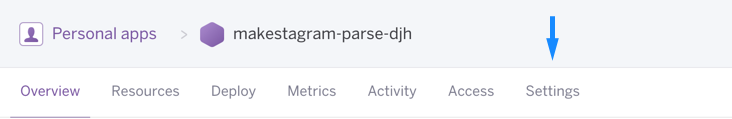
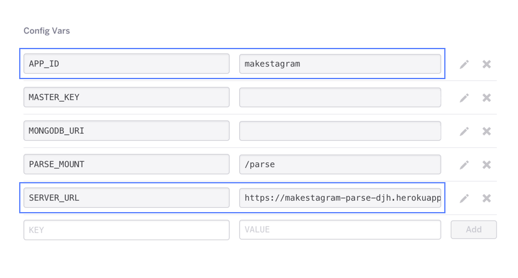

Since all of the features of *Makestagram* rely on the Parse framework, we will set it up as a very first step.

The Parse framework requires us to provide the *URL* and *ID* of our Parse App as soon as our iPhone app starts. That way our iPhone app and our backend can establish a connection.

In order to set up the Parse SDK, we will first need to ask ourselves the following question: *Where is the right place to add code that must be executed upon app launch?*

#Configuring the SDK on App Launch

Every new iOS project is created with a class called `AppDelegate`. This class has methods that get called when the app is started, put into the background, or closed. These actions (starting, going into the background, and closing), are referred to as *lifecycle* events.  Whenever we want to respond to such events, the `AppDelegate` is the right place to add our code. If you open the *AppDelegate.swift* file, inside the *Makestagram* project, you will see the different lifecycle methods. If you are curious about the responsibilities of each of these methods, check out this Apple [documentation](https://developer.apple.com/library/ios/documentation/iPhone/Conceptual/iPhoneOSProgrammingGuide/TheAppLifeCycle/TheAppLifeCycle.html). For now, we are mainly interested in the following method:

    func application(application: UIApplication, didFinishLaunchingWithOptions launchOptions: [NSObject: AnyObject]?) -> Bool {
        // Override point for customization after application launch.

        return true
    }

This method is called as soon as our app starts - this is where we need to add the code to configure the Parse SDK.

> [action]
Add an import statement (`import Parse`) to import the Parse SDK into the `AppDelegate`. Then we are going to configure and initialize Parse into the `application(application:didFinishLaunchingWithOptions:launchOptions:)` method. The result should look like this:
>
    import UIKit
    import Parse
>
    @UIApplicationMain
    class AppDelegate: UIResponder, UIApplicationDelegate {
>
        var window: UIWindow?
>
        func application(application: UIApplication, didFinishLaunchingWithOptions launchOptions: [NSObject: AnyObject]?) -> Bool {
>
            // Set up the Parse SDK
            let configuration = ParseClientConfiguration {
                $0.applicationId = APP_ID
                $0.server = SERVER_URL
            }
            Parse.initializeWithConfiguration(configuration)
>
            return true
        }
>
      ...

Next, we need to replace the current placeholders for the `APP_ID` and the `SERVER_URL` with the correct values for our Parse server that we set up.

> [info] If you've forgotten the exact values of your `APP_ID` and `SERVER_URL`, you can find them like this:
>
> 1. Go to the [Heroku Dashboard](https://dashboard.heroku.com/apps).
> 1. Click the name of your Parse Server app.
> 1. Click the settings button 
> 1. Click the reveal config vars button 
> 1. Your `APP_ID` and `SERVER_URL` are listed 

<!-- html comment to break boxes -->

> [action]
Copy your *APP_ID* and *SERVER_URL* into the Parse SDK setup. Make sure you make them `String`s by surrounding them in quotes! Here's an example of what that may look like:
>
    func application(application: UIApplication, didFinishLaunchingWithOptions launchOptions: [NSObject: AnyObject]?) -> Bool {
>
        // Set up the Parse SDK
        let configuration = ParseClientConfiguration {
            $0.applicationId = "makestagram"
            $0.server = "https://makestagram-parse-abc.herokuapp.com/parse"
        }
        Parse.initializeWithConfiguration(configuration)
>
        return true
    }

**Make sure you include your values! Not these example ones.**

Now we should be ready to work with the Parse SDK! In a moment we will see if you've set everything up correctly.

But before we do, lets take a quick look at that code again. Notice anything weird with it? `$0`? What does that mean? Well, that is actually shorthand for this:
>
	let configuration = ParseClientConfiguration { (configuration) -> Void in
	    configuration.applicationId = "makestagram"
	    configuration.server = "https://makestagram-parse-abc.herokuapp.com/parse"
	}

In this case, Swift lets you avoid defining the closure and just jump into it with `$0` representing the first argument it would have taken.


#Adding a Fake Login

All features in *Makestagram* (e.g. posting photos, following friends, etc.) will require a logged in user. This means that before we can start building our actual app, we need a way for a user to log in.

For now, we are going to provide a fake login mechanism so that we can start working on the core features of the app. (Later in this tutorial we will spend some time building a full login mechanism, including login with a Facebook account.)

Implementing a fake login mechanism involves two steps:

1. Creating a test user in the Parse backend
2. Adding code to the `AppDelegate` to log in as that test user

Parse allows us to add data directly to the database through the browser by creating new *Rows* in our Parse tables. This is a great feature for testing!
> [action]
Add a test user to your Parse database by following the steps in the video below. 
>
   Click the *User* class in the left column. Then, in the top right corner, click the *Edit* button and *Add a row* option. This will create a new blank User entry. Double click into the *username* column of this row and enter *test* as a username. Then double click the *password* column and enter *test* as a password.

You have created your first set of data for this application! Now we can use this test user to log in on the iOS App.
>
Extend the `AppDelegate` to log in with our test credentials. We'll also add an `if` statement to test if the login was successful. Change the relevant code in the `AppDelegate` to look like this:
>
```
func application(application: UIApplication, didFinishLaunchingWithOptions launchOptions: [NSObject: AnyObject]?) -> Bool {
>
	// Set up the Parse SDK
    let configuration = ParseClientConfiguration {
        $0.applicationId = "makestagram"
        $0.server = "https://makestagram-parse-abc.herokuapp.com/parse"
   	 }
   	 Parse.initializeWithConfiguration(configuration)
>
    do {
        try PFUser.logInWithUsername("test", password: "test")
    } catch {
        print("Unable to log in")
    }
>
    if let currentUser = PFUser.currentUser() {
        print("\(currentUser.username!) logged in successfully")
    } else {
        print("No logged in user :(")
    }
>
    return true
}
```

We are using the `loginWithUsername` method of `PFUser` to programmatically sign in with the info of the test user that we just created. `PFUser` is the default Parse class for user objects. We will use it whenever we interact with user accounts.

After we performed the login we check if it was successful. The `PFUser.currentUser()` method returns an optional `PFUser?`. If no user is logged in, this method returns `nil`; otherwise it returns a `PFUser` object. We use an optional binding (`if let user = PFUser.currentUser()`) to check if the result of the method call was a `PFUser`.

Depending on the result we print a success or failure message to the console using the `print` function.

Also, note the `do/catch` error handling. Since this is placeholder code, we will leave it as is, but we will touch on the subject later in the tutorial.

> [action]
Now it's time to run the app! You should see the following console output (if the console does not show up, use the following shortcut: ⌘+⇧+C):


In the last line we can see the output: `test logged in successfully`. This means everything has worked correctly! Congratulations, you have just logged into your Parse app.

However, we also see a warning message above this output (*Warning: A long-running operation is being executed on the main thread*). For now we can ignore this warning - we will devote a fair amount of time later in this tutorial to discuss threading and long-running operations.

Now we're good to move on and can start to work on the core of the app. As discussed, later in this tutorial we will replace this fake login with a real login screen.

In the next section we will learn how to use a `UITabBarController` to create the basic structure of our app!
