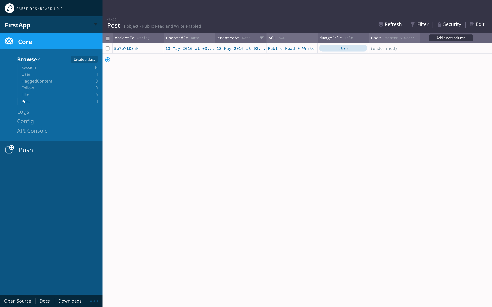

Up until now we have barely interacted with the Parse SDK, besides the initial setup in our `AppDelegate`. That will change moving forward! In this step you will learn how to insert data into the Parse database. Later on you will also learn how to query and download data.

In this step we will write the code that uploads our photo to Parse!

#Writing Information to Parse

What steps are involved in writing data to Parse? In most cases, it is a three step process. Here's the simplest example from the Parse Quickstart guide:

    let testObject = PFObject(className: "TestObject")
    testObject["foo"] = "bar"
    testObject.saveInBackgroundWithBlock { (success: Bool, error: NSError?) -> Void in
        print("Object has been saved.")
    }

The three steps in this code snippet are:

1. Creating a `PFObject` with a class name that matches one of our Parse classes (in our app this could be "Post", "User", etc.)
2. Set a value for a certain property of that instance using a *subscript* (the square brackets after the variable name)
3. Call one of the available `save...` methods on the instance

After the last step completes, your data is stored in the Parse database; however, this is only the simplest of all use cases.

Uploading a photo in **Makestagram** is a little bit more complex, but it's still only a few lines of code.

#Adding the Upload Code

Why is our use case a little bit more complicated than the one shown above? Primarily because not only do we want to upload an image, but we also want to create an instance of the Parse `Post` class.

Here's a short reminder of what the `Post` class looks like:

You can see that the actual image file is stored _as part of the Post_. This means that our upload code needs to create a post object that can be stored in Parse. Additionally, it needs to upload the image that gets stored within that post.

Files are handled a little differently compared to regular objects in Parse, so we don't use the `PFObject` class to create them. Instead we used the specialized `PFFile` class.

> [action]
> 
**Try to implement this step on your own!** First create a PFFile with the image data, then a PFObject for the post. Remember that the post needs a reference to the uploaded image! Place your solution in the `PhotoHelper` callback within `TimelineViewController`. Don't forget to `import Parse`. You will need to use a function called `UIImageJPEGRepresentation` to convert the `UIImage` into `NSData` to be passed to the `PFFile`.

<!-- html comment to break boxes -->

> [solution]
First, add an import statement to the top of the *TimelineViewController.swift* file to import the Parse framework:
>
    import Parse
>
Now, here's one possible solution for the callback:
>
    photoTakingHelper = PhotoTakingHelper(viewController: self.tabBarController!, callback: { (image: UIImage?) in
        if let image = image {
            let imageData = UIImageJPEGRepresentation(image, 0.8)!
            let imageFile = PFFile(name: "image.jpg", data: imageData)!
>
            let post = PFObject(className: "Post")
            post["imageFile"] = imageFile
            post.saveInBackground()
        }
    })

There shouldn't be too many surprises in these lines. The most interesting one is the very first one. We turn the `UIImage` into an `NSData` instance because the `PFFile` class needs an `NSData` argument for its initializer. Also, we give it the name `"image.jpg"`. We could name it anything, but by making the name end in `.jpg` we make it easier to look at our uploaded photos on the dashboard. But what is that `!` doing at the end?!  It takes the optional returned from the `PFFile` constructor, and _force_ unwraps it. Keep in mind that by using _force_, the application will crash if the unwrap fails. The documentation for Swift explains that this is only meant to be used if a failure to unwrap is considered to be a total failure.

Also, what does the `0.8` represent? `UIImageJPEGRepresentation` takes a mandatory _float_ argument from `0.0` to `1.0` representing JPEG image quality. The higher the number, the higher the quality but the larger the size as well. A lower number represents lower quality but a smaller file size.

Next we create and `save` the `PFFile`.

In the next step we create a `PFObject` of type post. We assign the `"imageFile"` to this post and then save it as well.

##Testing the Uploading Code

Now it's time to test our solution! Run the app and select an image. You should see a similar result as shown below:

<video width="100%" controls>
  <source src="https://s3.amazonaws.com/mgwu-misc/SA2015/PhotoUpload_Working_small.mov" type="video/mp4">
</video>

Now let's first see if the upload actually worked as expected.

The best way to do that is to use the Parse data browser. It will give us a nice overview of all the objects that have been created on our server.

> [action]
Open your browser and open your parse dashboard (ideally you should keep it open throughout the rest of this tutorial). If you forgot the URL, you can go to [heroku.com](https://www.heroku.com/). Click your dashboard server, then click the *Open app* button.

Then select the _Post_ class in the left bar of the data browser. You should see one entry for this class:

If you want to be 100% sure that everything worked correctly, you can click on the uploaded image in the imageFile column, and your browser will open the image that you have uploaded.

#Conclusion

**Congratulations!** This means you have successfully uploaded data to Parse! The few issues with delays and console warnings aside - this is an important step towards building **Makestagram**.

However, there are many things to improve here:

1. We need to handle the result of saving in the background. What if the user isn't connected to the internet?
2. We need to store more information along with the `Post` that we're creating. Right now we are only storing the image file, but we also need to store the `user` to which the post belongs.

In the next step we will move from this very simple upload code to a more mature solution.
